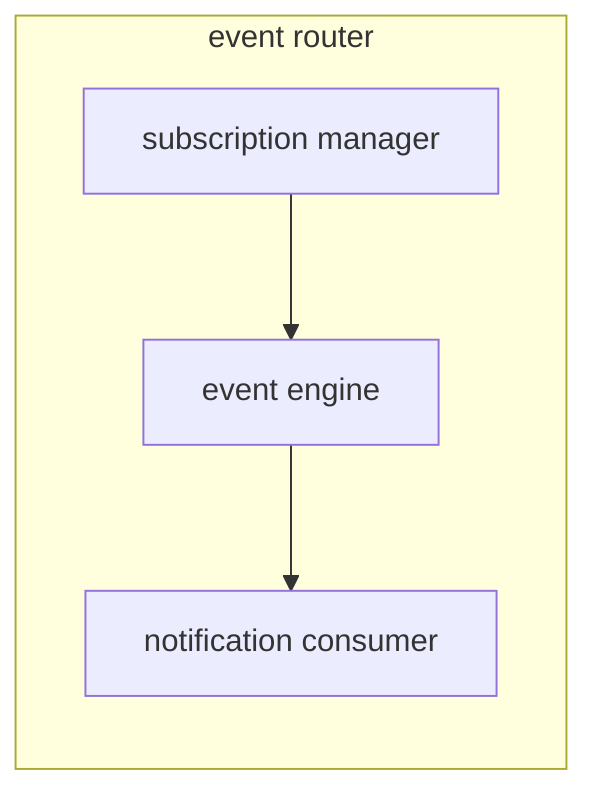

# MESSAGING SYSTEMS 

Based on the concept of decoupling the two endpoints of the connections in order to overcome the mobility of the 2 nodes, (tcp connection migrations ecc...)

This approach tends to separate clearly the communication so that the  2 nodes does not communicate directly with each other but communicate whit an intermediate node that store the message until the other node is ready for receive the message

## JMS

## CORBA

System with the aim of exchanging object between active components independently by the language of implementation, based on remote method invocation

Corba also supports message exchange, with AMI (asincronous message interface) and TII (time independent invocation)

## XMPP (EXTENSIBLE MESSAGING AND PRESENCE PROTOCOL)

Protocol develop for large scale distributed application to notify if a user is connected to the application (*online status*).
It's  a pub sub protocol with messages codified in xml format 
The standard requires to instantiate a new connection for each message exchange

Android use a proprietary implementation to address this issues

The protocol manages one-to-one and one-to-many communication

- message stanza one-to-one mechanism
- presence stanza one-to-many mechanism based on pub/sub
- info/query stanza request-response mechanism

## EVENTS 

In a distributed environment events and messages show the same characteristics and can be handled by similar systems

## EVENT ROUTER

Decouples in time the publisher and the subscriber it exploits routing tables to route the events to the subs, using also filters

## EVENT ROUTING 

Event routing can be done in multiple ways

- **simple routing**  every broker has the same routing table
- **covering-based routing** only the more general subscription are routed, exploiting the fact that general subscription are supersets of more specific ones
- **merging based routing** merging the different rows of the routing tables in order to reduce the exchange of data between routers, it can be used in tandem with covering-based routing

The more sophisticated routing strategies show problems in the un-subscription phase and force the routing table to take tracks of which subscription an entry is done for