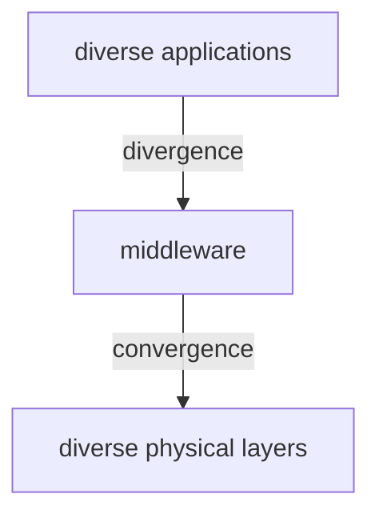

# ANDROID MIDDLEWARE

Managing many aspect of a mobile system is  a complex problem that needs solutions on many layers, sometimes even cross layer. 
some of the topics are:

- nodes 
- networks
- users
- session
- services
- objects

mobile middleware solutions are positioned from the 4 layer of the ISO/OSI protocol stack

## WHAT IS A MIDDLEWARE?

Middleware can be defined as:

*support software application agnostic that resolve problems at ISO layer >= 4*

So that developers can focus on business logic of applications

## WHY THE NEED OF A MIDDLEWARE?

Wireless connectivity technologies are growing in number and functionalities and application requirements changes with time and deployment scenarios.
In this situation not using middleware results in big efforts in order to maintain the application and all ISO layers problems that comes with it

## MOBILE MIDDLEWARE

Mobile middleware has to overcome different challenges due to the nature of the deployment environment, some examples of challenges are:

- Need of decoupling in space and in time (client server communication, handle namespace changes)
- Asynchronous events, spaces for data sharing
- Basic approach in many cases of wireless computing
- Adoption of proxies
- In addition, provisioning of some level/degree of visibility of running conditions to lower layers (sometimes reflective middleware)
- Transparency to location in RPC/RMI
- In mobile envs, partial visibility of location change, modifications in the QoS levels currently available

There are also network principle to respect

#### END TO END PRINCIPLE

application state and intelligence need to stay at the endpoint of the connection
#### ROBUSTNESS PRINCIPLE

cit from Jon Postel:

*Be conservative in what you do, be liberal in what you accept from others*

Needs to be compliant with RFCs but be able to accept inputs from non RFCs compliant communications, 

## CROSS LAYER 

Information can be exchanged between layers in several ways, this needs to be accounted for

