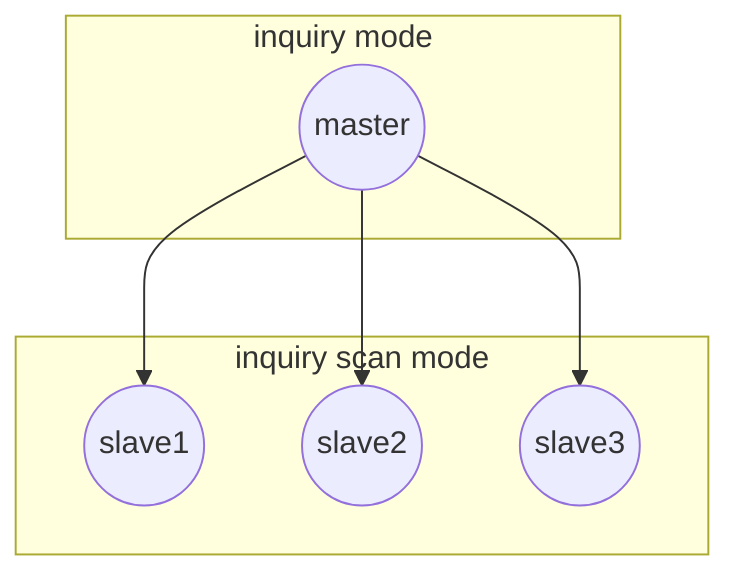
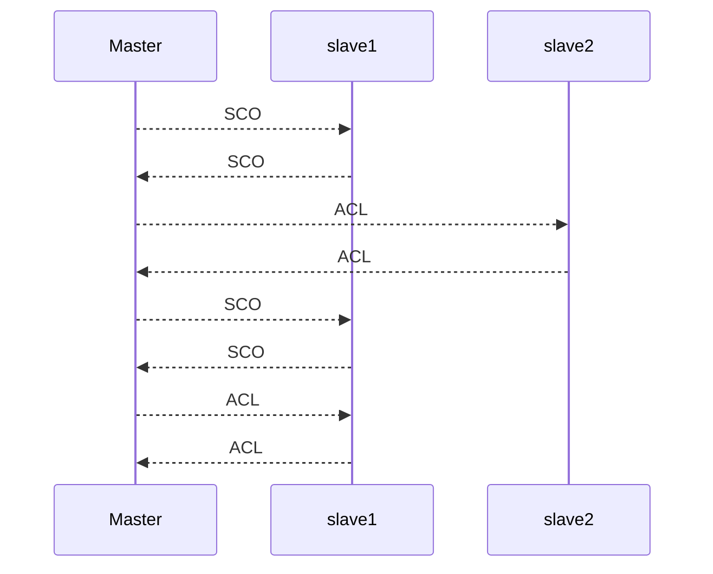
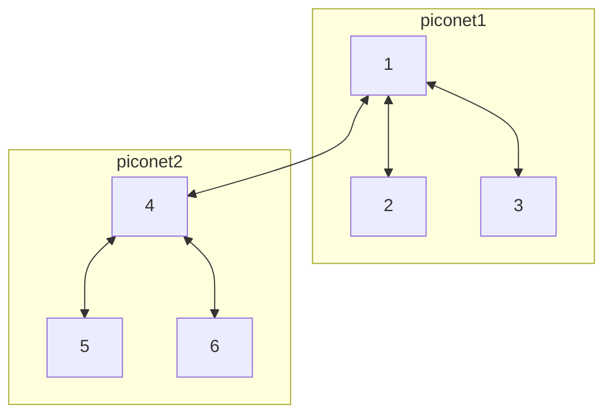

# IEEE 802.15.1 (BLUETOOTH)

Protocol for PAN implementation, based on 2.4 frequencies band,it aims to the following goals:

- low cost device
- low distance communication 
- voice and data management

This comes with the cost of lower bandwidth so lower data transfer rate

It also used in PANs where one of the nodes play the role of master of the network (PICO-NET)

Bluetooth is a complex stack of protocols at different layer and devices can implement only a subset of functionality and not all 

## BLUETOOTH VS WIFI

| WIFI                                        | BLUETOOTH                                                   |
| ------------------------------------------- | ----------------------------------------------------------- |
| multi node communication                    | point to point communication only                           |
| no discovery needed                         | need of discovery phase in order to communicate with a node |
| communication can be done in broadcast mode | no efficient broadcast support                              |

## PREPARATION PHASE

In order to communicate 2 nodes need to complete a preparation phase in order to construct the topology

The base topology is called PICO-NET where:

- there is always a unique master node
- up to 7 active nodes 
- communication happens on a single channel using [frequency hopping](https://it.wikipedia.org/wiki/Frequency-hopping_spread_spectrum)

The preparation phase is spit in 2 sub-phases:

### INQUIRY PHASE

a node start the discovery of nearby nodes and become the master

### PAGING PHASE

master establish a bidirectional communication channel in frequency hopping with the slave nodes

One of the main constraint of bluetooth communication is that **nodes need to have their clock synchronized**, this is done by imposing the master clock to the slaves that adapts their clocks

## COMMUNICATION WITH MASTER

Time is divided by time slots in which only 2 nodes can communicate This is done in order to avoid collisions

The master decide which node can communicate, the master can communicate in all the odd slots

### CONNECTION TYPES

#### SCO CHANNELS

SCO packets are sent in pre-allocated time slots, in order to guarantee a fixed bandwidth (must have for audio streaming applications)

In order to avoid the consumption of all time slots the master can establish 3 SCO channels at the same time 

In this mode retransmissions are not allowed
#### ACL CHANNELS

ACL packets are best effort communication with no guaranteed bandwidth this allow for higher bandwidth, it also support asymmetric bandwidth allocation for the  2 directions

In this connection types the slave can transmit only if in the previous time slot has received a packet from the master

In this mode retransmissions are allowed

## SERVICE DISCOVERY PROTOCOL

Bluetooth has a discovery protocol in order to identify nodes in the range, this allows also to discover what service the device can offer

## MULTI HOP COMMUNICATION (SCATTER NET)

Bluetooth supports communication between PICO-NETs if the range allows it

In this configuration a node for each net is selected as the gateway that can forward traffic to the other net. This is a possibility allowed by the protocol but it's not implemented for performance reasons