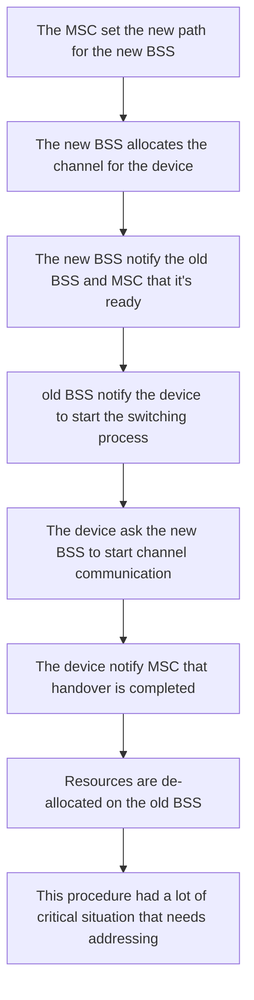

# CELLULAR NETWORKING

Originated from the evolution of telecom solution of communication of mobile devices, based on a grid of low powered antenna for scalability reason, frequencies can be reused in non adjacent cells

cells are ara coverage by a single base station, each base station is connected to a mobile switching center
The range of a single cell depends on many factors such as:

- landscape and obstacles
- technology used

small area cells can be used in more crowded areas

## TECHNOLOGY EVOLUTIONS

With time cellular networking technology converged in the internet communication technologies

| GENERATION | FEATURES                                 |
| ---------- | ---------------------------------------- |
| 2(GSM)     | digital communications, only voice calls |
| 2.5(GPRS)  |                                          |
| 3(UMTS)    |                                          |
| 4(LTE)     |                                          |

## GSM ARCHITECTURE

A big problem of cellular networking is to handle mobility of the phones during communication operations

## HANDOFF PROCEDURE

The old BSS decides when a handoff procedure is needed and sends to the mobile switching center with a list of possible new BSS's

The principle goal of this procedure it's service continuity so in this context wasting resources is accepted 

## HANDOFF TAXONOMY

| TAXONOMY          | MEANING                                                                                                        |
| ----------------- | -------------------------------------------------------------------------------------------------------------- |
| HORIZONTAL        | Handoff is performed between same technologies                                                                 |
| VERTICAL          | Handoff is performed between different technologies                                                            |
| MOBILE INITIATED  | Handoff is started by the mobile device                                                                        |
| NETWORK INITIATED | Handoff is started by the networking infrastructure                                                            |
| REACTIVE          | Handoff is started in response to a node exiting the coverage area                                             |
| PROACTIVE         | Handoff is started before the node exits the coverage area                                                     |
| HARD              | The handoff procedure does not allow the mobile node to be connected to multiple BSS in the same time interval |
| SOFT              | The handoff procedure allow the mobile node to be connected to multiple BSS in the same time interval          |
