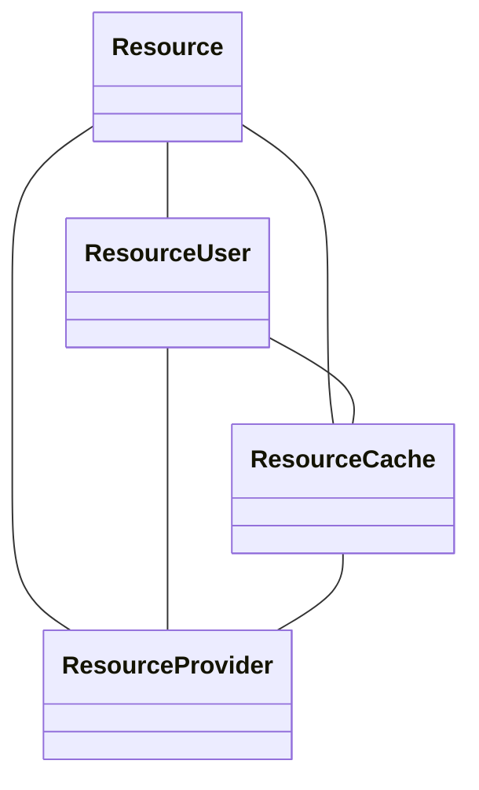
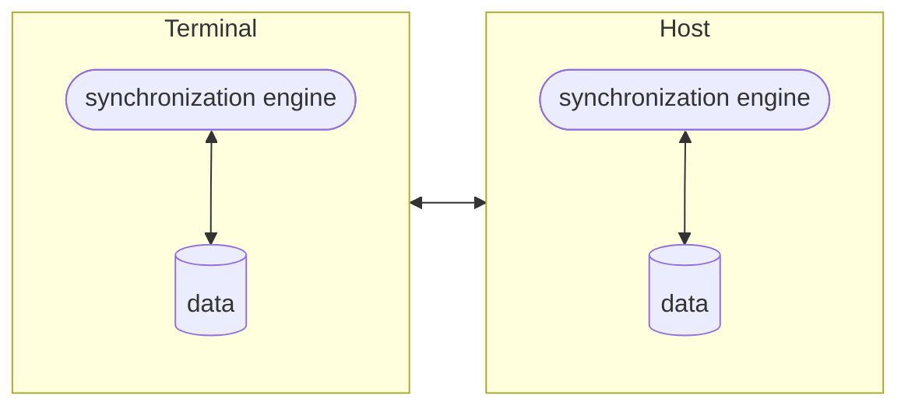
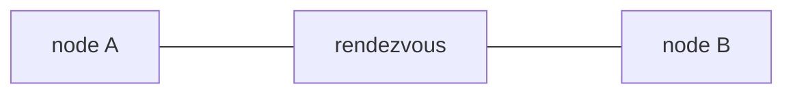

# DESIGN PATTERNS AND ARCHITECTURES

## PATTERNS FOR MOBILE COMPUTING 

### DISTRIBUTION
### RESOURCE MANAGEMENT AND SYNCHRONIZATION
#### session token
A token is sent to the client from the server that contains the session identifier in order to maintain the state of the session
#### caching
information are temporary stored in a cache 

the application try to access the cache and than escalates to the remote server in case of cache miss
Resources that are known to be used from the application can be pre-fetched and stored in the cache making cache more proactive 
#### lazy acquisition

Resources are acquired at the latest possible moment (when they are explicitly required from the application) This pattern relies on a proxy for the resources request handling

#### SYNCHRONIZATION

The objective of this pattern is to handle data synchronization between multiple instances that want to access the same resources
The idea is to interpolate a middleware component called `syncronization engine` that is responsible for handling the conflict resolution and synchronizing with the other components

when is not possible to resolve conflicts the engine has to alarm the application that a conflict as appeared

##### POSSIBLE SYNCHRONIZATION LEVELS

other parameter can be tuned in the implementation:

- When launching the synchronization operations
- How to manage synchronizations
#### RENDEZVOUS

The nodes synchronize themselves with the help of a third entity that is fixed examples DNS

#### STATE TRANSFER

Rendezvous pattern used to transfer state

### COMMUNICATION

#### CONNECTION FACTORY

Components used to instantiate connect and manage connection and to effectively decoupling the application from the communication system 

#### MULTIPLEXED CONNECTIONS

Pattern that relies on a single physical connection to run multiple logical connections (example Stream Control Transfer Protocol SCTP)

#### CLIENT INITIATED CONNECTION FOR PUSH MODEL

