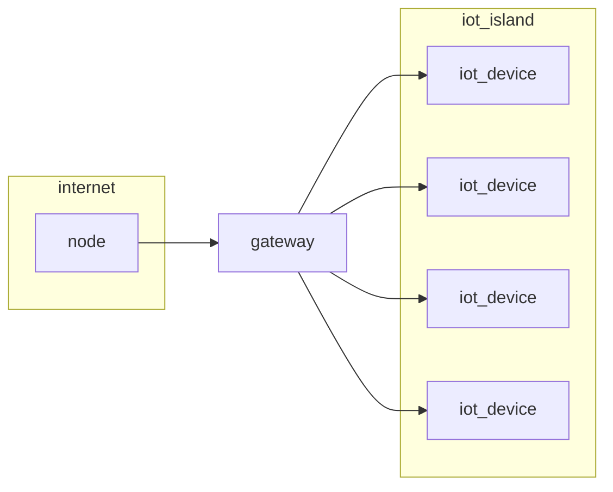

# INTERNET OF THINGS

System interconnected through the internet that can interact with the real world, common infrastructure approach is this

```mermaid
flowchart LR
subgraph internet
A[node]
end
F[gateway]
subgraph iot_island
B[iot_device]
C[iot_device]
D[iot_device]
E[iot_device]
end
A --> F --> B & C & D & E
```
