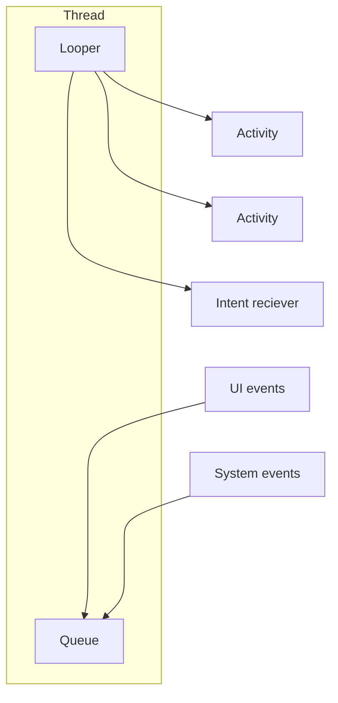

read this to setup with vscode
https://stackoverflow.com/questions/76763954/android-app-development-with-visual-studio-code
https://www.reddit.com/r/vim/comments/p5nhgs/comment/h9795oj/?utm_source=share&utm_medium=web3x&utm_name=web3xcss&utm_term=1&utm_content=share_button

## MAIN COMPONENT FRAMEWORK

| COMPONENT              | DESCRIPTION                                                                                           |
| ---------------------- | ----------------------------------------------------------------------------------------------------- |
| **ACTIVITY**           | Main application component that represent an interaction with the user                                |
| **INTENT**             | Request to perform an operation to the android framework (as sharing content)                         |
| **SERVICE**            | codes that runs in the background with no interaction with the user (**no dedicated process/thread**) |
| **BROADCAST RECIEVER** |                                                                                                       |
- activity
- intent
- service
- broadcast reciver

## ACTIVITY LIFECICLE


## CONVERSATION CONCEPT: ANDROID TASK

Android stores a stack called task which represents a sequence of activity that the user need to interact with initiated by a root activity


### APPLICATION INTERACTIONS: INTENT

Application can trigger the execution of other activities through intents, that can be:

- **explicit**: the component to activate is known at compile time
- **implicit**: the component to activate is not known at compile time and it needs to be discovered by the android runtime

applications need to define intent filters in order to signal to the android runtime that they are possible destination for a specific intent in the application **MANIFEST**:

```xml
<activity android:name="IntentActivity">
	<intent-filter>
		<action android:name="android.intent.action.MAIN" />
		<category android:name="android.intent.category.LAUNCHER" />
		<category android:name="it.mypackage.intent.category.CAT_NAME" />
		<data android:mimeType="vnd.android.cursor.item/vnd.mytype" />
	</intent-filter>
</activity>
```

## ANDROID: THREAD MODEL

each application as a single dedicated data driven thread that consumes a message queues




each application run on a dedicate dalvik virtual machine running as a UNIX heavy process in order to achieve application isolation, share memory at kernel level is implemented for faster communication between the dalvik virtual machines

this behavior can be changed by setting the `Android.sharedUserId` value to the  same in the manifest file

### ANDROID LINUX SCHEDULING

2 principal process groups 

- **Foreground group**: thread that will consume 90% of cpu time
- **Backgroud group**: thread that will consume 10% of cpu time
### ANDROID ASYNCHRONOUS PROGRAMMING

The android runtime model is not sufficient to obtain performance so some concurrency techniques are allowed:

- Thread
- Executor
 - HandlerThread
- **AsyncTask**
- **Service (already partially discussed)**
- IntentService
- AsyncQueryHandler
- Loader

## ANDROID CONCURRENCE: SERVICE

Services are components that perform long tasks (e.g. play music, network communication...) with no user interactions, they are started by intent from activities of other services.
The services **runs in the main thread of its hosting process**

### SERVICE LIFECICLE


