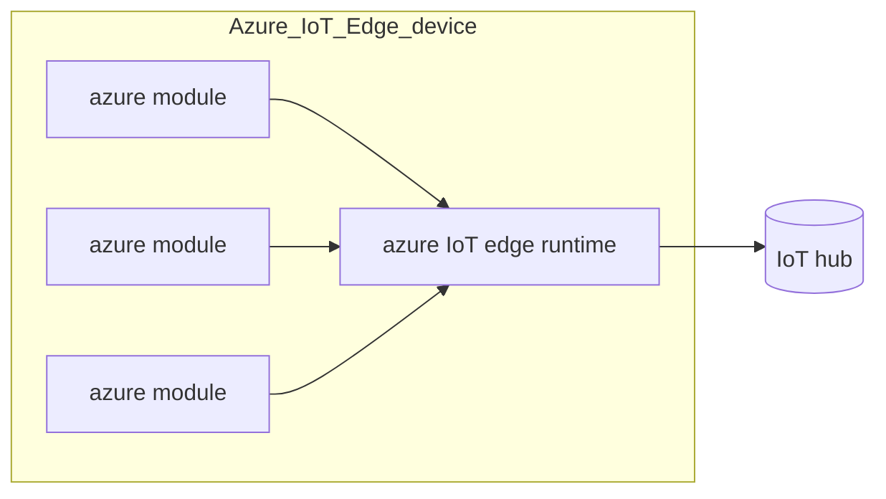

# AZURE IoT PLATFORM

Microsoft cloud solution for IoT application, the main component is the azure IoT hub that communicates with the IoT devices and redirect the dataflow to the cloud components

## AZURE IoT EDGE

azure IoT offers also the possibility to perform edge computing tasks thanks to the edge runtime, the edge device can run azure modules, that are the smallest computational entities of an azure IoT solution (*e.g. docker compatible containers*)

[PREVIOUS](pages/IoT/AWS_IOT_PLATFORM.md) [NEXT](pages/IoT/SIEMENS_MINDSPHERE.md)
