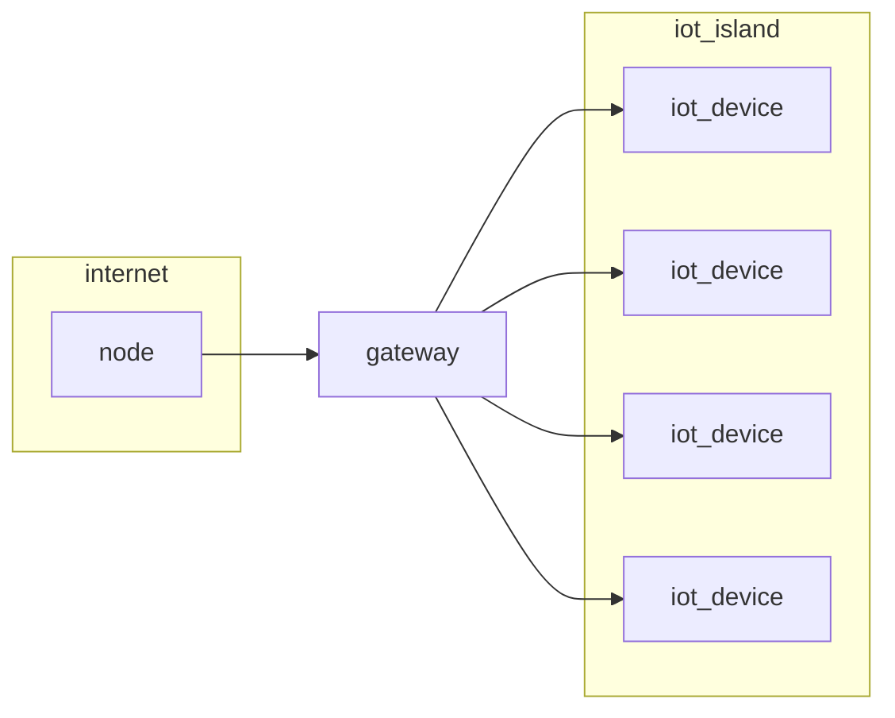

# INTERNET OF THINGS

System interconnected through the internet that can interact with the real world, common infrastructure approach is this

Where a gateway mediates the traffic from the common internet and the IoT device's network that could be build with different technologies at layer 2, 3 and 4 

The IoT network can have specific vertical requirements dictated by the deployment environment
