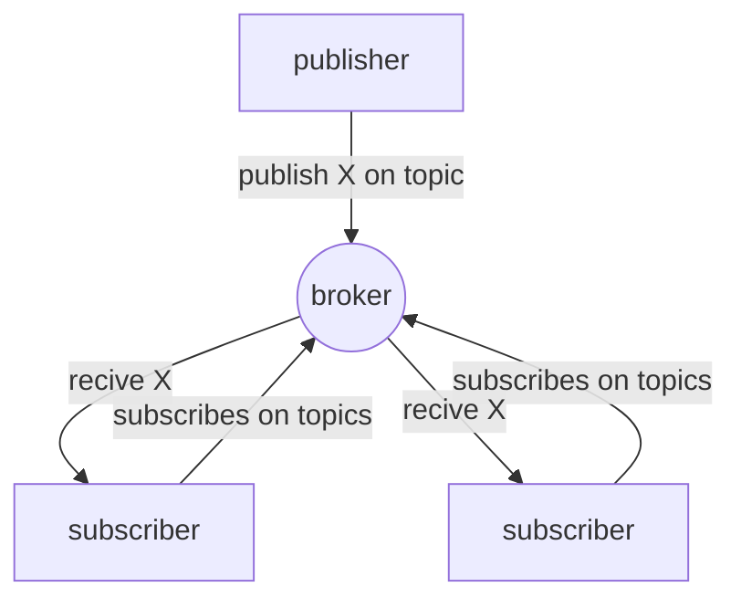

# PUB/SUB MODEL

model where  nodes plays the role  of publishers and subscribers, publisher send messages and subscribers subscribe to topics and receive messages based on the subscribed topics

PUB/SUB has the following properties

- **space decoupling** No need for the nodes to know each other
- **time decoupling** no need for the nodes to be connected at the same time
- **synchronization decoupling**  no need for the nodes to halt the operation flow to receive communications

[PREVIOUS](pages/IoT/IOT_PROTOCOLS.md) [NEXT](pages/IoT/PUB_SUB_PROTOCOLS.md)
