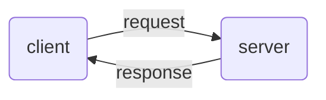

# REQUEST RESPONSE

Model of interaction where one of the nodes plays the role of the server listening and accepting communications by client machines that makes requests, in this model **only client can start a communication**

possible interaction with this model can be:

- **pull** actuators request configurations from the server
- **push** sensors send data to the server

[PREVIOUS](pages/IoT/PUB_SUB_PROTOCOLS.md) [NEXT](pages/IoT/REST.md)
