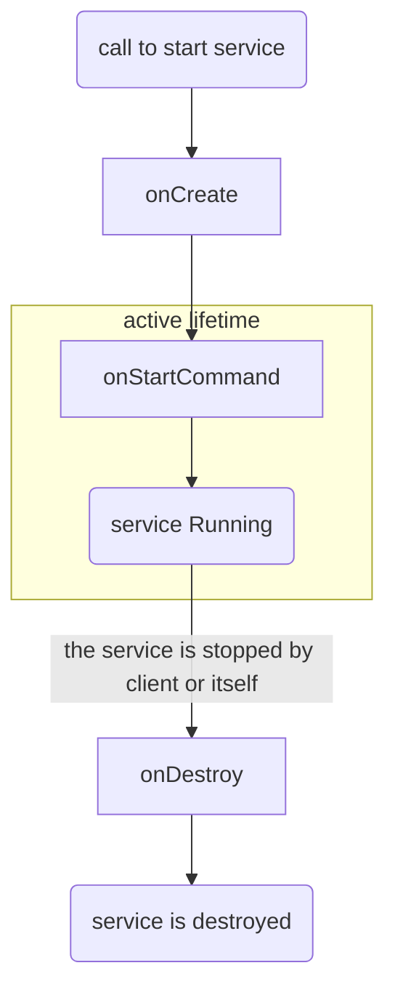
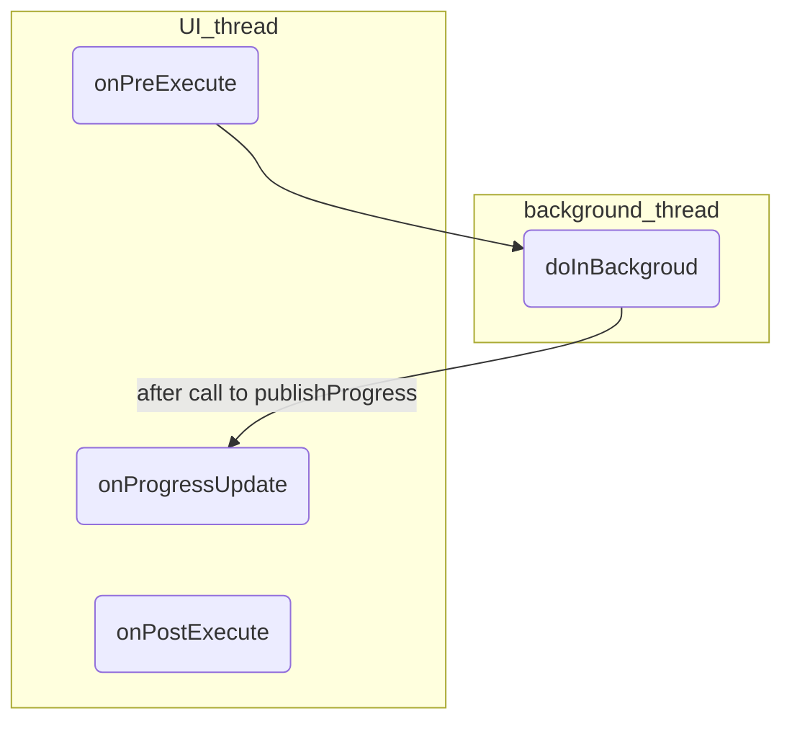

# ANDROID ASYNCHRONOUS TECHNIQUES

The android platform offers multiple ways to run tasks in concurrency with the main activity

- **Thread**
- **Executor**
- **HandlerThread**
- **AsyncTask**
- **Service** (*already partially discussed*)
- **IntentService**
- **AsyncQueryHandler**
- **Loader**

## SERVICE

Service are components that **share the application main thread** and can perform long running tasks with **no user interaction**, they are triggered by application intent

a service expose a client server interface for application to bind and send requests, when all applications are unbounded the service is terminated

### FOREGROUND SERVICES

more priority than background services but the user must be aware that they exists (*e.g. music players*)

### INTENT SERVICES

Use a set of worker thread to fullfill requests and stops when done, also lifecicle is simplified

## THREADS

Similar to the java threads main differences are:

- they cannot be destroyed by the invocation of `destroy`
- they cannot work with the user interface

## HANDLER

associated with a thread and is message queue, it delivers/handle messages and can be used to schedule tasks or interact with other threads queue

## ASYNC TASK

It's created in the UI thread and work in a background thread, the **results is published in the UI thread**

it accepts 3 parameters:

- **Params**, the type of the parameters sent to the async task upon execution
- **Progress**, the type of the progress units published during the background computation
- **Result**, the type of the result of the background computation

it goes through some phases:

## WHY ONLY ONE THREAD TO MANAGE UI?

The android UI toolkit is not thread safe so manipulation in concurrent threads are not guaranteed to be consistent

[PREVIOUS](pages/android/THREADING_MODEL.md) [NEXT](pages/android/JOB_SCHEDULER.md)
