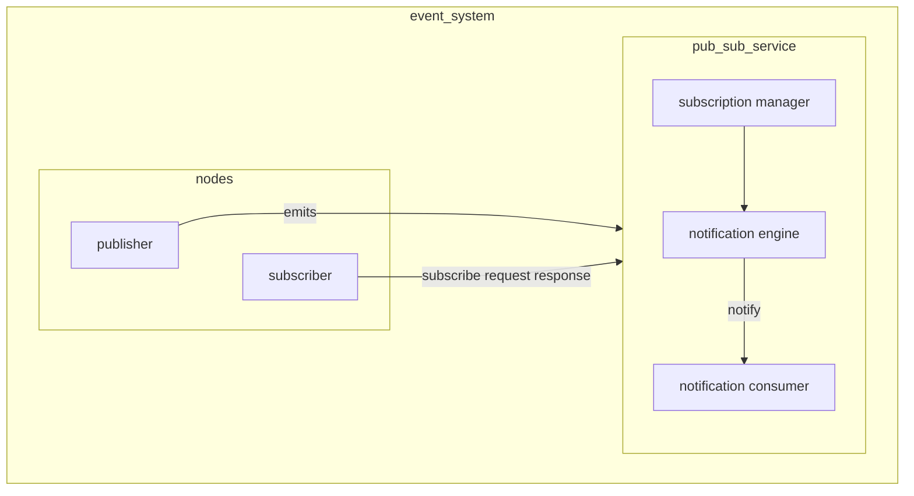

# EVENTS 

Events can be defined as temporary constrained massages that needs to be processed as quickly as possible

## EVENTS VS [MESSAGES](MESSAGING.md)

In a mobile environment events and messages show the same characteristics and can be handled by similar systems

Follow this idea events can be seen as messages with some content in a [pub/sub](PUB_SUB_MODEL.md) model where publisher are the nodes where the event is generated and subscribers are the nodes that are interested to the specific event

All consideration for [messages](MESSAGING.md) are valid also for events, some specific events question can be:

- **Anonymous communication**
- **Possibility to use filters** (on headers or entire messages)
- **Different topologies for routing** and different semantics associated to event sending/notification
-  **non-blocking operations** (polling, callback)
## GENERAL ARCHITECTURE OF A EVENT SYSTEM

An event system is based on a central [pub/sub service](PUB_SUB_MODEL.md) to achieve decoupling of the publisher and subscribers

## EVENT ROUTER

Entity that implements the [pub/sub service](PUB_SUB_MODEL.md), the router achieves decoupling, implement filters trough the use of routing tables and other QoS functionalities (*delivery with deadlines,fault-tollerance,ordering* )

Possible topologies can be:

- centralized
- hierarchical
- cyclic acyclic
- based on [rendezvous points](DESIGN%20PATTERN%20AND%20ARCHITECTURES.md#RENDEZVOUS)

## ROUTING POLICIES

- **simple routing**  every broker has the same routing table
- **covering-based routing** only the more general subscription are routed, exploiting the fact that general subscription are supersets of more specific ones
- **merging based routing** merging the different rows of the routing tables in order to reduce the exchange of data between routers, it can be used in tandem with covering-based routing

The more sophisticated routing strategies show problems in the un-subscription phase and force the routing table to take tracks of which subscription an entry is done for

## MESSAGE ROUTING FILTERS

Filters can be implemented at different levels:

- **Channel/topic-based** depending on the channel 
- **Subject-based** depending on event subject
- **Header-based** depending on a set of fields. (*For example, SOAP supports header-based routing for its messages*)
- **Content-based** possibly depending on the whole message content. Higher expressive power, higher costs