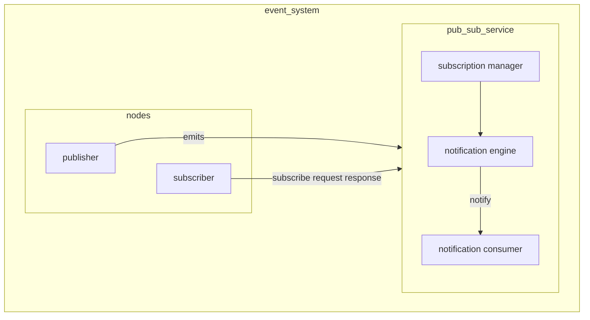

# EVENTS

Events can be defined as temporary constrained massages that needs to be processed as quickly as possible

## EVENTS VS [MESSAGES](MESSAGING.md)

In a mobile environment events and messages show the same characteristics and can be handled by similar systems

Follow this idea events can be seen as messages with some content in a [pub/sub](PUB_SUB_MODEL.md) model where publisher are the nodes where the event is generated and subscribers are the nodes that are interested to the specific event

All consideration for [messages](MESSAGING.md) are valid also for events, some specific events question can be:

- **Anonymous communication**
- **Possibility to use filters** (on headers or entire messages)
- **Different topologies for routing** and different semantics associated to event sending/notification
-  **non-blocking operations** (polling, callback)
## GENERAL ARCHITECTURE OF A EVENT SYSTEM

An event system is based on a central [pub/sub service](PUB_SUB_MODEL.md) to achieve decoupling of the publisher and subscribers




## EVENT ROUTER

Entity that implements the [pub/sub service](PUB_SUB_MODEL.md), the router achieves decoupling, implement filters trough the use of routing tables and other QoS functionalities (*delivery with deadlines,fault-tollerance,ordering* )

Possible topologies can be:

- centralized
- hierarchical
- cyclic acyclic
- based on [rendezvous points](DESIGN%20PATTERN%20AND%20ARCHITECTURES.md#RENDEZVOUS)

## ROUTING POLICIES

- **simple routing**  every broker has the same routing table
- **covering-based routing** only the more general subscription are routed, exploiting the fact that general subscription are supersets of more specific ones
- **merging based routing** merging the different rows of the routing tables in order to reduce the exchange of data between routers, it can be used in tandem with covering-based routing

The more sophisticated routing strategies show problems in the un-subscription phase and force the routing table to take tracks of which subscription an entry is done for

## MESSAGE ROUTING FILTERS

Filters can be implemented at different levels:

- **Channel/topic-based** depending on the channel
- **Subject-based** depending on event subject
- **Header-based** depending on a set of fields. (*For example, SOAP supports header-based routing for its messages*)
- **Content-based** possibly depending on the whole message content. Higher expressive power, higher costs

## JAVA EVENTS

Java implements a solution for event based distribution based on RMI (*e.g. [apache river (jini)](SERVICE_DISCOVERY.md#APACHE%20RIVER%20(JINI))*) where a remote event listener notifies registered consumers with a remote object:

```java
package net.jini.core.event;

public class RemoteEvent {
	public long getID();
	public long getSequenceNumber();
	public java.rmi.MarshalledObject getRegistrationObject();
}
```

there is also a lease mechanism and the possibility to define adapters to implement QoS and filters (*no already given implementation*)

## OMG DISTRIBUTED DATA SERVICE (DDS)

OMG specification  for data distribution service designed for real-time systems.
The system is designed for [pub/sub](PUB_SUB_MODEL.md) oriented communications where the data space is accessed trough a middleware that offers general API. Content filtering and QoS negotiation are supported

### PARTITIONS

Partitions are namespaces to allow the logical splitting of a DDS domain where publisher/subscribers can decide **at runtime**  on which partitions to publish/subscribe data.

For a reader to receive data there is the need to share the same topic and partition as the source, **partition can also enforce a QoS policy**


### RELIABILITY

Possibility to enforce policy on message delivery

- **BEST_EFFORT** NOT guaranteed that all messages are received, NOT guaranteed delivery order
- **RELIABLE** – guranteed that all messages are received and delivery order. Via Publishers that re-send data to Subscribers if needed and via Subscribers that send reception feedback (ack)
### DURABILITY

Three possible specification for message storing

- **volatile** message are not stored
- **transient** message are stored in central memory
- **persistent** message are stored in persistent memory

## GENERAL EVENT NOTIFICATION ARCHITECTURE (GENA)

Primary used solution in [UPnP](SERVICE_DISCOVERY.md#UNIVERSAL%20PLUG%20AND%20PLAY%20(UPnP)), for event notification, control nodes subscribe to events trough a SOAP http request and receive unicast notification

```xml
NOTIFY delivery path HTTP/1.1
HOST: delivery host:delivery port
CONTENT-TYPE: text/xml
NT: upnp:event
NTS: upnp:propchange
SID: uuid:subscription-UUID
SEQ: event key
<e:propertyset xmlns:e="urn:schemas-upnp-org:event-1-0">
	<e:property>
		<variableName>new value</variableName>
	</e:property>
	Other (possible) names of variable and associated values
</e:propertyset>
```

[PREVIOUS](pages/discovery_messages_events/EXTENSIBLE_MESSAGING_AND_PRESENCE_PROTOCOL.md)
