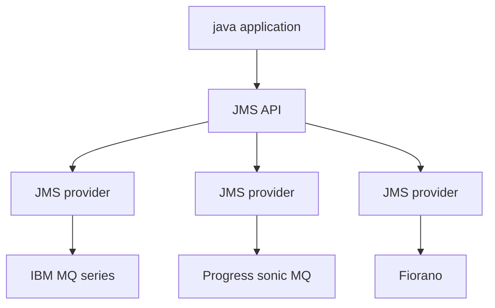
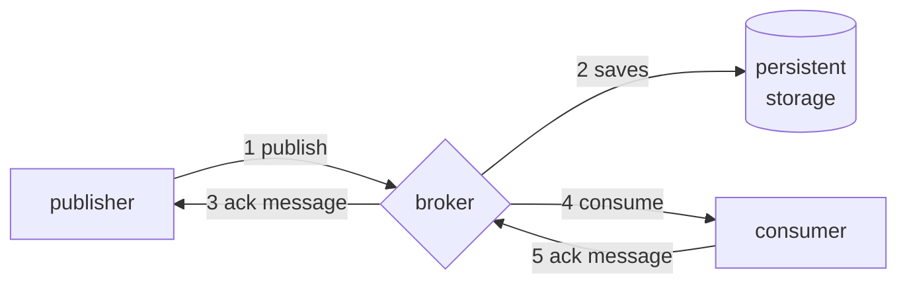

# JAVA MESSAGE SERVICE (JMS)

Java solution for messaging systems, key features are:

- only-once, at-most-once semantics support
- Decoupling in time thanks to durable destinations
- Possibility of non-blocking reception via listeners
- Messages sent within a session (via a given Session object) towards the same destination benefit from in-order delivery property

## VENDOR AGNOSTIC

JMS is independent from specific vendor solution and allow the application to interact with them in a transparent way

## [RELIABILITY ](MESSAGING.md#RELIABILITY%20AND%20QoS) in JMS

reliability is handled trough ACK messages that are given from the JMS broker to the publisher and from the consumer to the broker

ACKS can be of 3 different types:

- **lazy**
- **automatic**
- **client side**

JMS allow to specify store semantics of a message:

- **PERSISTENT** messages are guaranteed that are saved at the JMS provider side
- **NON_PERSISTENT** messages are not saved on persistent storage

[PREVIOUS](pages/discovery_messages_events/MESSAGING.md) [NEXT](pages/discovery_messages_events/CORBA_MESSAGING.md)
