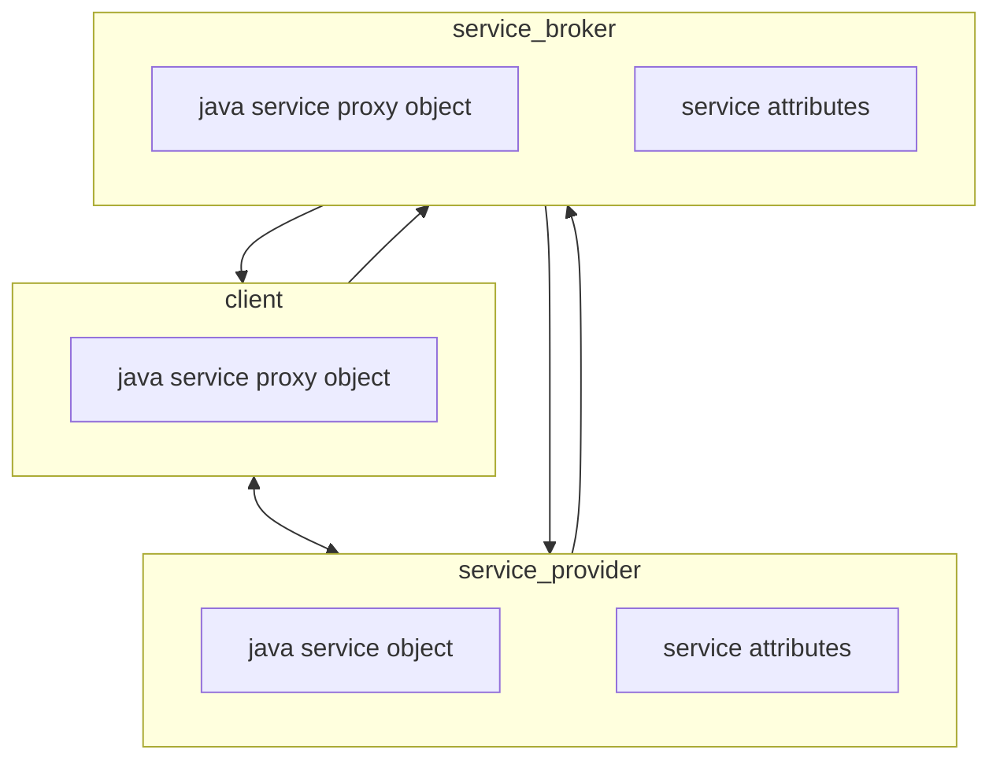
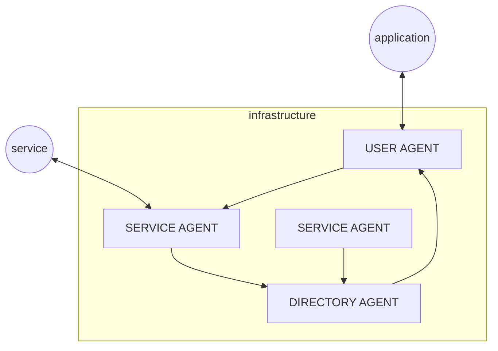
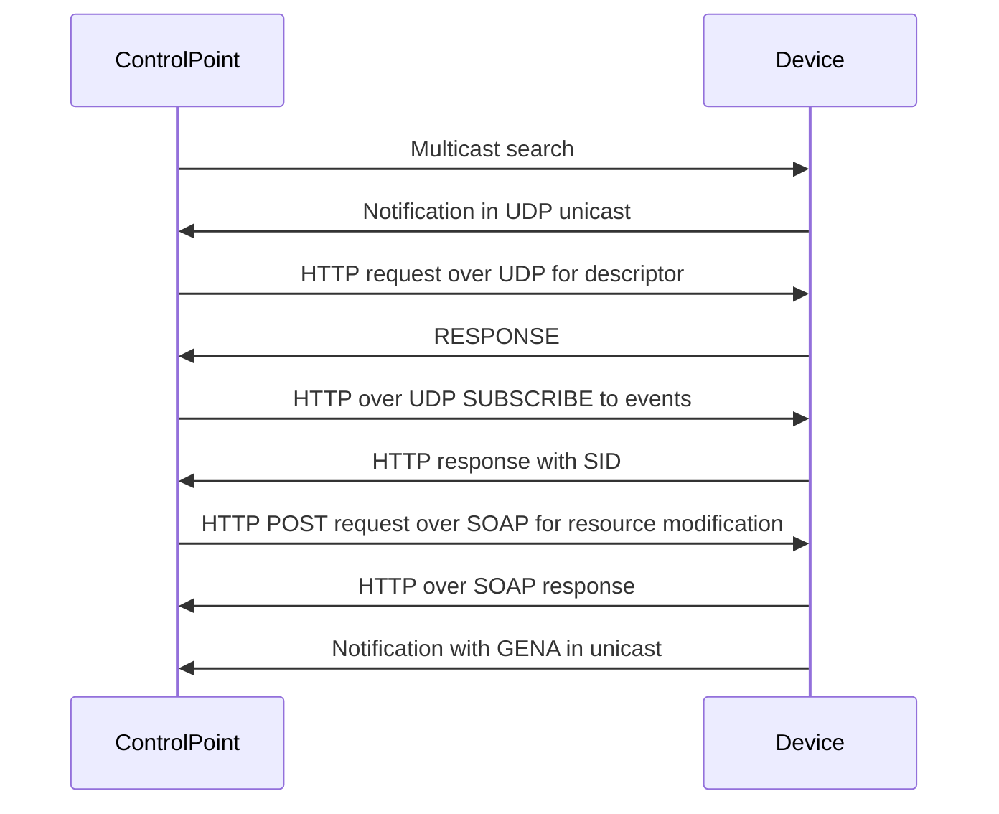

# SERVICE DISCOVERY
Service discovery is the procedure that allow an application to search for available services in the locality of the application node, a service discovery solution must meet the following requirements

- **AUTO CONFIGURATION** devices must configure themselves to participate to the the offering requesting communications
- **DISCOVERY** advertisement of services from the service provider
- **ACCESS** clients need to be able to communicate with services discovered

## APACHE RIVER (JINI)

Java solution for service discovery, based on a central node playing the role of service broker where nodes register and discover services (*similar to the [pub/sub model](PUB_SUB_MODEL.md)*)



The protocol relies on service providers registering a proxy object to the service broker that can be received by clients in the discovery phase in order to communicate with the service provider

Failures are managed trough a **lease** mechanism where the resource assigned to client has a lease time, also the registration phase is managed with lease

The protocol supports scalability by allowing the service providers to subscribe to multiple service brokers and

### STUB SKEL LIMITATIONS

JINI overcomes stub and skeleton limitations, cause client can get the proxy objects at runtime from the broker

## SERVICE LOCATION PROTOCOL (SLP)

service agents makes periodic broadcast of the available services and user agent listen for the request for the application, optionally a directory agent can be deployed for caching purposes



## UNIVERSAL PLUG AND PLAY (UPnP)

De-facto standard of service discovery, microsoft developed solution to connect tv remote to the network, the UPnP supports:

- **Automated IP configuration**
- **Discovery** of resources and services
- **Description of resources/services** based on XML
- **Service control** based on SOAP
- **Event management** (via Generic Eventing and Notification Architecture - GENA)
- **Presentation** in HTML/XML

### AUTOMATIC IP CONFIGURATION

A UPnP node tries to connect to a network by asking a DHCP server an address, if no DHCP server is available it selects a random ip (*169.254.0.0/16 for IPv4*) in a range and exploits ARP requests to verify if other machines have the same address

### DISCOVERY

DIscovery in UPnP is achieved with the **simple service discovery protocol** (SSDP*), that uses multicast communication on specific addresses and ports over UDP (*239.255.255.250 on port 1900*)

Nodes that offer services perform periodic broadcast communications on the network, a node that ask for services perform a discover communication and a service can respond with a unicast communication with the url and xml descriptor of the resource


### SERVICE REPRESENTATION

The capabilities of a device are communicated trough XML format, a device can offer different `<service>` capabilities that includes:

- Service type and service ID
- Service URL for invocation via SOAP
- URL for event subscription to enable notifications
- An additional file (*Service Description File*) for any offered service, with more specific and detailed descriptions

an example of file:

```xml
<serviceList>
	<service>
		<serviceType>urn:schemas-upnp-org:service:control:1</serviceType>
		<serviceId>urn:upnp-org:serviceId:control</serviceId>
		<controlURL>isapictl.dll?control</controlURL>
		<eventSubURL>isapictl.dll?control</eventSubURL>
		<SCPDURL>projector-scpd.xml</SCPDURL>
	</service>
</serviceList>
```

### COMMAND CONTROL

In order to send commands to a UPnP able device a SOAP request is performed with an XML payload to describe the request, service updates the resource and respond with a SOAP reply

### EVENT MANAGEMENT

A control node can subscribe to event to the URL specified in the service discovery phase, notifications are delievered trough the use of General Event Notification Architecture (*GENA*) standard, that includes in the XML request the variable modification that triggered the event

**A node can only subscribe to the notification of single state variable change**



[PREVIOUS](pages/IoT/COAP.md) [NEXT](pages/discovery_messages_events/MESSAGING.md)
