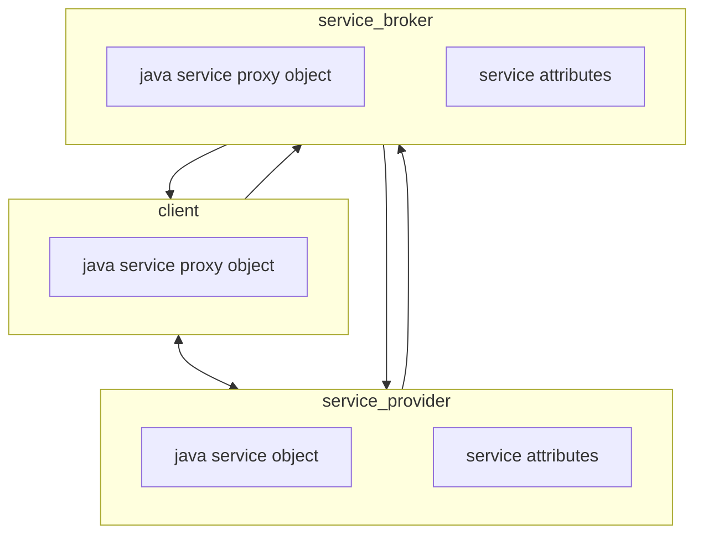
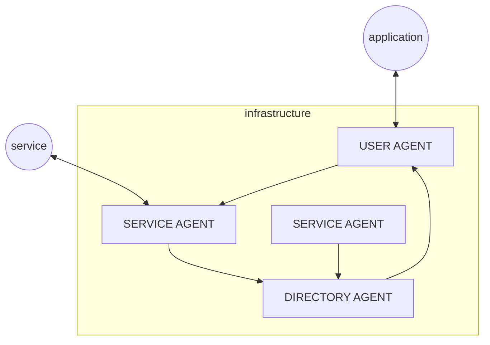

# SERVICE DISCOVERY

Service discovery is the procedure that allow an application to search for available services in the locality of the application node, a service discovery solution must meet the following requirements

- **AUTO CONFIGURATION** devices must configure themselves to participate to the the offering requesting communications
- **DISCOVERY** advertisement of services from the service provider
- **ACCESS** clients need to be able to communicate with services discovered

## APACHE RIVER (JINI)

Java solution for service discovery, based on a central node playing the role of service broker where nodes register and discover services (*similar to the [pub/sub model](PUB_SUB_MODEL.md)*)

The protocol relies on service providers registering a proxy object to the service broker that can be received by clients in the discovery phase in order to communicate with the service provider

Failures are managed trough a **lease** mechanism where the resource assigned to client has a lease time, also the registration phase is managed with lease 

The protocol supports scalability by allowing the service providers to subscribe to multiple service brokers and 

### STUB SKEL LIMITATIONS

JINI overcomes stub and skeleton limitations, cause client can get the proxy objects at runtime from the broker

## SERVICE LOCATION PROTOCOL (SLP)

service agents makes periodic broadcast of the available services and user agent listen for the request for the application, optionally a directory agent can be deployed for caching purposes

## UNIVERSAL PLUG AND PLAY (UPnP)

