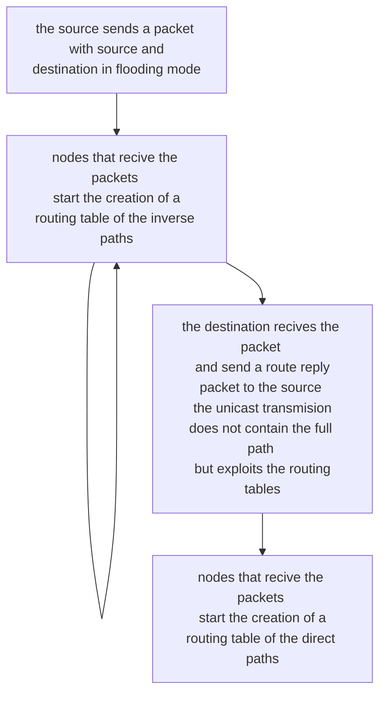

# AD HOC ON DEMAND DISTANCE VECTOR

AODV tries to address the problem of the variable sized header of [DSR](DYNAMIC%20SOURCE%20ROUTING.md) by maintain a reduced routing table suitable for manets

## PATH TABLE STRUCTURE

### INVERSE PATHS C TABLE EXAMPLE

| SOURCE | DESTINATION | DISTANCE FROM THE SOURCE |
| ------ | ----------- | ------------------------ |
| S      | D           | 1                        |

### DIRECT PATHS C TABLE EXAMPLE

| SOURCE | DESTINATION | NEXT HOP | DISTANCE FROM THE DESTINATION |
| ------ | ----------- | -------- | ----------------------------- |
| S      | D           | F        | 3                             |

The direct path tables is the one the does the heavy lifting in data packet routing, the inverse path is only needed for the route reply routing

## ROUTE ERROR 

In the route error scenario the node that detects the route error situation informs the other nodes like in [DSR](DYNAMIC%20SOURCE%20ROUTING.md) and they update their routing table, the message is broadcast to the neighbors route error to inform them

## LINK FAILURE DETECTION

Extension that force all nodes to send hello messages to the neighbors in order to discover broken routing table lines

## POSSIBLE OPTIMIZATION

In a route request situation an intermediate node can respond with something in the routing table 
