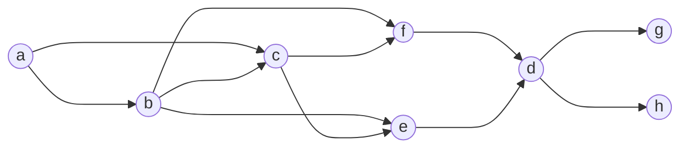

# MANET (MOBILE AD HOC NETWORK)

Manets are network with the following caracteristics

- Created dynamically (on-the-fly) to satisfy needs and reqs that are typically temporary
- Immediate and highly reconfigurable deployment (NO fixed infrastructure)
- High “volatility”
- Mobility, failures/faults, node resources that vary over time
- Nodes with very differentiated features (heterogeneity)
- Nodes with limited energy (battery-operated)
- Any node can play the role of potential router
- Multi-hop communications

Given the nature of MANETS a lot of challenges comes up

- Limited transmission range
- Broadcast nature of the wireless medium (e.g., hidden terminal)
- Packet loss due to transmission errors
- Modifications to routing and established paths due to mobility
- Packet loss induced by mobility
- Network partitioning is possibly frequent
- Energy constraints
- Easy “snooping” of wireless transmissions (associated security issues)

## MANET ROUTING

Manet routing is a big challenge cause there are no fixed assumptions that can be made on the network characteristics so a lot of routing protocols where been proposed.

- Dynamic Source Routing (**DSR**)
- Ad hoc On-demand Distance Vector routing (**AODV**)
- Greedy Perimeter Stateless Routing (**GPSR**)

### MANET PROTOCOLS CLASSIFICATION

| **NAME**       | DESCRIPTION                                                                                          |
| -------------- | ---------------------------------------------------------------------------------------------------- |
| **PROACTIVE**  | maintain valid routes independently on ongoing traffic,Generally, minor latency and greater overhead |
| **REACTIVE**   | Maintain valid routes only if needed (on-demand)                                                     |
| **GEOGRAPHIC** | Usage of knowledge of destination location to perform forwarding                                     |
| **HYBRID**     | combination of the precedents                                                                        |

Manet routing protocols are **REACTIVE** because the nature of the MANET create 

## FLOODING (level 0 solution)

Simple method of routing with a lot of stupid assumption that allow to extrapolates the problems in man routing 

each node send the packet to all of the nodes in his visibility

In this iteration a lot of problems occurs as it is a very bad performance solution but it has some advantages:

- packet are duplicated
- the protocol is extremely simple
- higher reliability due to the fact that multiple paths are discovered

There are a lot of disadvantages of course

- Potentially high overhead
- potentially low reliability

