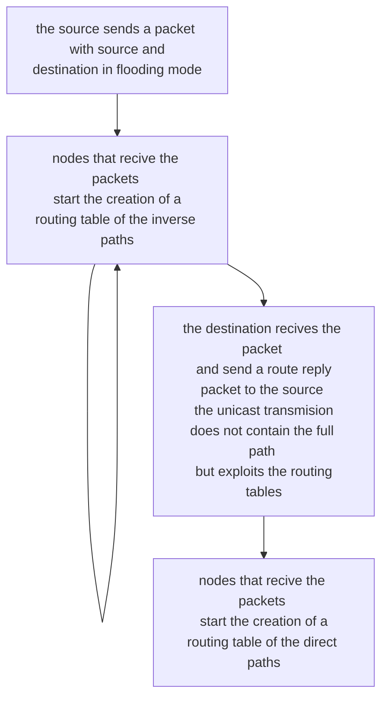

# AD HOC ON DEMAND DISTANCE VECTOR

AODV tries to address the problem of the variable sized header of [DSR](DINAMIC_SOURCE_ROUTING.md) by maintain a reduced routing table suitable for manets

## LIMIT THE ROUTING PROBLEMS OF MANETS

In order to avoid limit the header lenght problem, 2 routing tables are used:

- **inverse path routing table** that is used to route the route reply packets, the records on this table are removed after a timeout

| SOURCE | DESTINATION | DISTANCE FROM THE SOURCE |
| ------ | ----------- | ------------------------ |
| S      | D           | 1                        |

- **direct path routing table** that is used to route the actual traffic to the destination this table does the heavy lifting

|     | DESTINATION | NEXT HOP | DISTANCE FROM THE DESTINATION |
| --- | ----------- | -------- | ----------------------------- |
| S   | D           | F        | 3                             |

## ROUTE ERROR

In the route error scenario the node that detects the route error situation informs the other nodes like in [DSR](DYNAMIC%20SOURCE%20ROUTING.md) and they update their routing table, the message is broadcast to the neighbors route error to inform them

## LINK FAILURE DETECTION

Extension that force all nodes to send hello messages to the neighbors in order to discover broken routing table lines

## AVOID THE FLOODING PROPAGATION

In order to avoid the excessive flooding if an intermediate node has already the route information can respond with  a route reply, this generate some loop problems

### USING DSN TO AVOID LOOPS

So in order to avoid loops, an integer value is introduced (DSN) that is incremented with each propagation of a route request packet, if the
