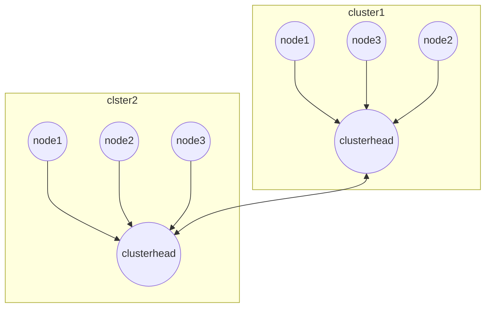

# CLUSTERING

Clustering is a method that aims to reduce the routing complexity by dividing the network in small subsystems called clusters, for each cluster a **clusterhead** is selected that works as the natural backbone of the network

there are several ways to elect a **clusterhead**

- **LEECH** a node make a local decision if it should serve as a clusterhead then nodes connect to the closest clusterhead, clusterhead is periodically reasigned to improve energy consumption
- **HEED** a node announce that it's intention to become clusterhead and the other nodes votes the clustered with the minimal cost

## CLUSTERING PROBLEMS

creating optimal clusters is an np-complete problem so forget about optimal clustering and in a Manet situation where nodes are highly mobile there is no certain that a cluster will not become sub-optimal in the long run.

Clusterhead plays a delicate role in a cluster, the role is suitable for less mobile nodes, with less energy restrictions

[PREVIOUS](pages/manets/TEMPORARY_ORDERED_ROUTING_ALGORITHM.md) [NEXT](pages/positioning_systems/BASE_TECHNIQUES.md)
