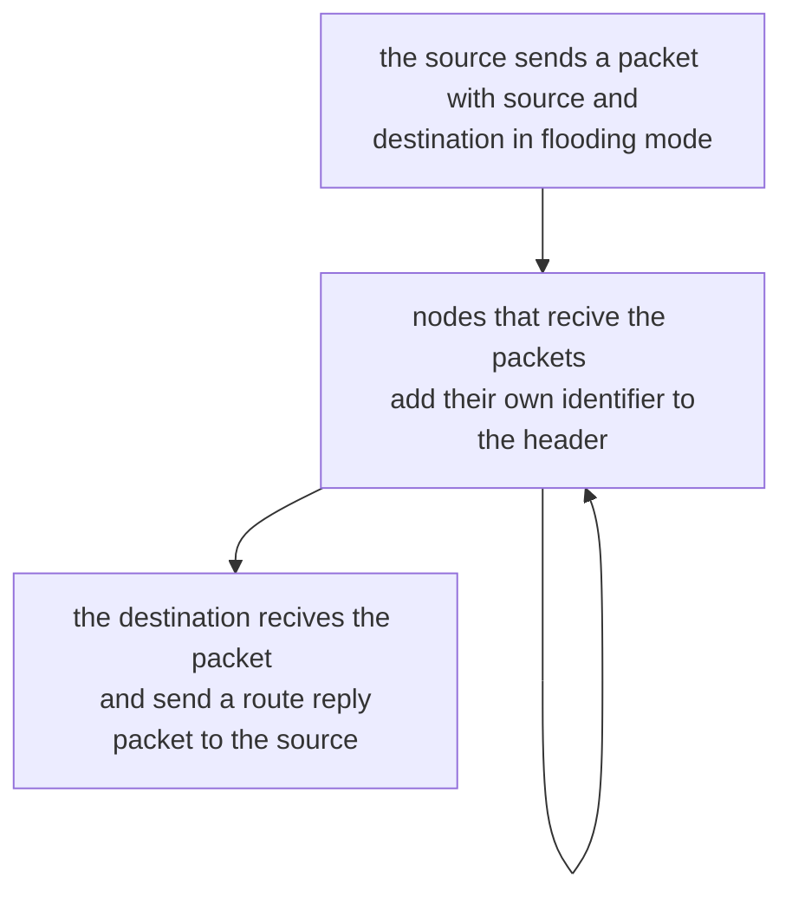

# DINAMIC SOURCE ROUTING

DSR is a  reactive routing protocol that exploids floading to get routing informations
the source calculate the paths when starting to send a packet, to achieve that it exploits flooding

## ROUTE DISCOVERY

Before starting a communication the source start a route discovery process to find the route to the destination

The source cache the path (without timeouts) as a valid path to the destination, the intermediate nodes does not cache any information, and the header size increase with the route lenght

## ROUTE ERROR

When a node cannot forward the request to the next node in a path the node send a ROUTE ERROR packet to the node in the path before him

## PATH CACHING

a possible optimization is to cache the paths in the intermediate node, this reduce the number of flooding operations and can improve the performance but it also bring the cache invalidation problem to the table

| ADVANTAGES                                                                        | DISADVANTAGES                                                                                                             |
| --------------------------------------------------------------------------------- | ------------------------------------------------------------------------------------------------------------------------- |
| Paths are maintained only among nodes that need to communicate (reduced overhead) | Growth of packet header size                                                                                              |
| Caching can reduce the overhead associated with routing discovery                 | RREQ flooding                                                                                                             |
| Each discovery can lead to the determination of multiple paths to                 | Necessary mechanisms to avoid RREQ collisions among neighbors                                                             |
| destination because of intermediaries that reply based on local caches            | Increase of channel conflicts when sending RREP (RREP storm issue; overhearing and local decision based on shortest path) |
|                                                                                   | RREPs that use stale cache (affecting other caches in cascading)                                                          |

[PREVIOUS](pages/manets/MANETS_ROUTING.md) [NEXT](pages/manets/ADHOC_ON_DEMAND_DISTANCE_VECTOR.md)
