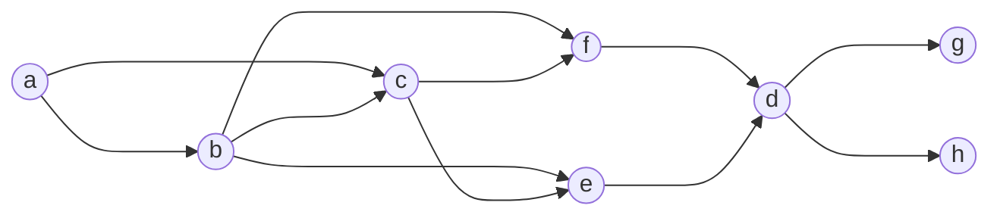

# MANET ROUTING

Manet routing is a big challenge cause there are no fixed assumptions that can be made on the network characteristics so a lot of routing protocols where been proposed.

- Dynamic Source Routing (**DSR**)
- Ad hoc On-demand Distance Vector routing (**AODV**)
- Greedy Perimeter Stateless Routing (**GPSR**)

### MANET PROTOCOLS CLASSIFICATION

| **NAME**       | DESCRIPTION                                                                                          |
| -------------- | ---------------------------------------------------------------------------------------------------- |
| **PROACTIVE**  | maintain valid routes independently on ongoing traffic,Generally, minor latency and greater overhead |
| **REACTIVE**   | Maintain valid routes only if needed (on-demand)                                                     |
| **GEOGRAPHIC** | Usage of knowledge of destination location to perform forwarding                                     |
| **HYBRID**     | combination of the precedents                                                                        |

Manet routing protocols are **REACTIVE** because the nature of the MANET create

## FLOODING (level 0 solution)

Simple method of routing with a lot of stupid assumption that allow to extrapolates the problems in man routing

each node send the packet to all of the nodes in his visibility

### ADVANTAGES

In this iteration a lot of problems occurs as it is a very bad performance solution but it has some advantages:

- packet are duplicated
- the protocol is extremely simple
- higher reliability due to the fact that multiple paths are discovered

### DISADVANTAGES

There are a lot of disadvantages of course

- high overhead
- low reliability

[PREVIOUS](pages/manets/WIFI_DIRECT.md) [NEXT](pages/manets/DINAMIC_SOURCE_ROUTING.md)
