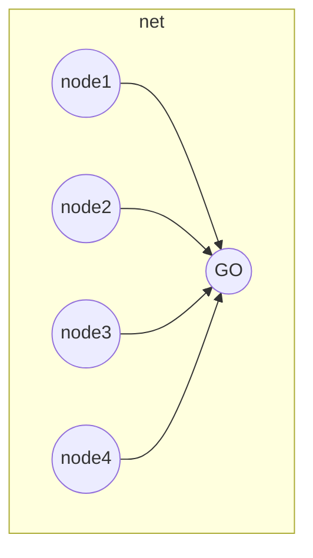

# WIFI DIRECT

WiFi direct is the WiFi solution for ad hoc networks, It provides a node that plays the role of the Group owner GO and serve the other WiFi capable nodes like an AP in infrastructured mode:

There are some limitations:

- the group owner cannot be changed in a session
- cross connectivity must pass trough the GO and need to be handled at the network layer (e.g. thorugh NAT)
- if the GO leaves the group the network is destroyed and need a new creation process

## GO DETERMINATION

there are 2 phases for the formation of a WiFi network group:

- determination of the GO
- provisioning of the GO

Determination of the group owner can be done by 2 modes:

- negotiation between devices
- establish the GO at the application level

## GROUP FORMATION

There are three ways to perform group formation:

- **standard** p2p devices discovers each other and then [determines the group owner](#GO%20DETERMINATION)

- **autonomous** a device create a group and becomes the group owner waiting for

- **persistent** a group is marked as persistent using WiFi direct beacon and nodes can exploits invitation to accelerate the group creation process

## POWER SAVING

Two ways to implement power saving capabilities

- **opportunistic** the GO saves energy when the nodes are sleeping

- **Notice of absence** the GO announces time intervals when the nodes are not allowed to communicate in the channel

## SECURITY

WiFi direct uses WPS to implement a simple layer of security that has minimum user interaction requirements (*ask pin or ask for confirmation*)

[PREVIOUS](pages/manets/MANETS.md) [NEXT](pages/manets/MANETS_ROUTING.md)
