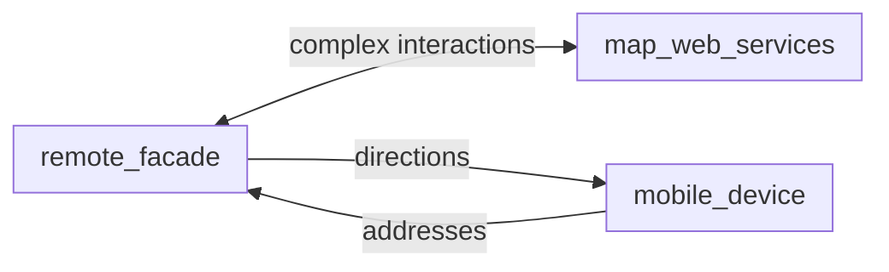
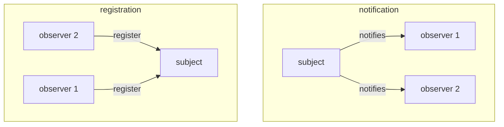

# DISTRIBUTION PATTERNS

Patterns that rule the way resources are distributed and access around the network at runtime

## REMOTE FACADE

A Coarse-grained interface towards fine-grade objects that a client can use to request for services without knowing the services details

### PROS
- decoupling between Client and Server
-  no disconnection problems due to asynchronous request/response model
-  server communication details are transparent to the mobile device

## DATA TRANSFER OBJECT (DTO)

Pattern to communicate data in a serializable data chunk called **container**  that are exchanged in communications between nodes

### PROS

- reduction of the remote calls to services cause data are transferred in a single communication

## REMOTE PROXY

Pattern that relies on all communication to travel to a proxy server that encode/decode communications to servers, applies filters evaluate request and perform heavy processing on the requests

### PROS

- the proxy performs the heavy operation instead of the mobile node
- proxy works as an adapter for the services behind

## OBSERVER

Pattern to implement one to many communications, a single object register for a specific subject and it's notified when the state of the subject changes

### PROS

- decoupling between subject and observer
- one to many communication support by design

### CONS

- not to much scalable since a single node as the responsibility for communication

[PREVIOUS](pages/mobile_middleware/PATTERNS.md) [NEXT](pages/mobile_middleware/RESOURCE_MANAGEMENT_PATTERNS.md)
