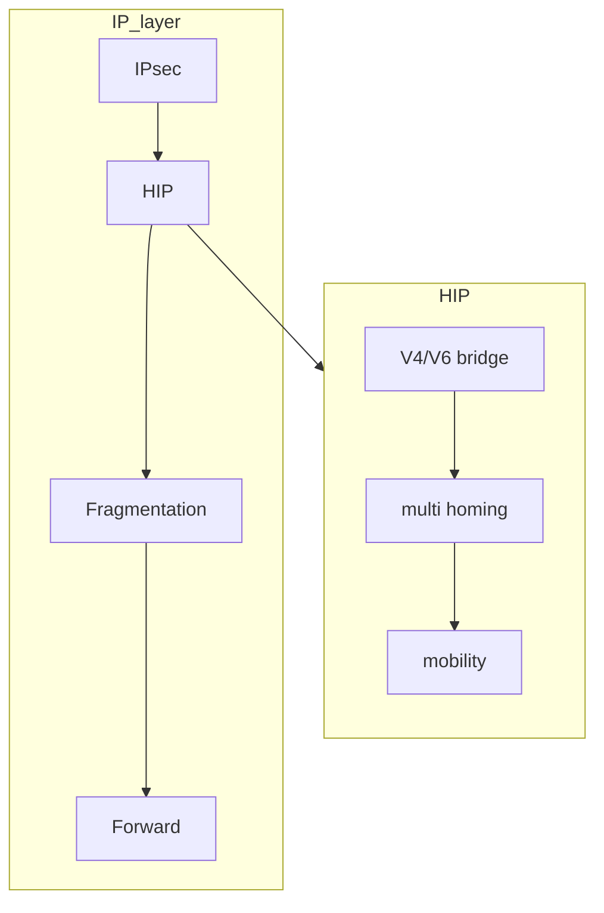

# HOST IDENTITY PROTOCOL

Complete revision of the ip protocol in order to separate location and identity of a node, the protocol integrates cryptographic Host Identifiers in the ip stack, ipv4,ipv6 interoperability

[PREVIOUS](pages/mobility/MOBILITY_IP_NETWORKS.md) [NEXT](pages/mobility/MOBILE_IP.md)
