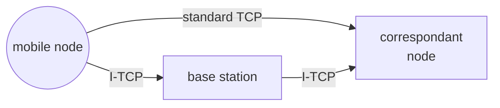

#  I-TCP

[MIP](MOBILE_IP.md) [HMIPV6](HIERARCHICAL_MOBILE_IPV6.md) [PHMIPV6](PROXY_HIERARCHICAL_MOBILE_IPV6.md)  does not take in to account the problems that occurs at the transport layer as for the **TCP protocol every disconnection and reconnection is treated as a high congestion situation**, so TCP slows traffic to resolve the congestion

The idea in I-TCP is to split the connection exploiting a middle node

## HANDOFF

The handoff procedure is dependent on the [mobile ip **one**](MOBILE_IP.md), when a mobile node register is CoA at the home agent, I-TCP handoff starts and in the meantime packets are buffered at the middle node

## ADVANTAGES

- flow and congestion control are separated in the 2 segments
- retrocompatibility with TCP

## DISADVANTAGES

- Breaks the end to end principle for witch only the endpoint of the communication are aware of the communication channel
- the middle node maintains state

[PREVIOUS](pages/mobility/PROXY_HIERARCHICAL_MOBILE_IPV6.md) [NEXT](pages/mobile_middleware/MOBILE_MIDDLEWARE.md)
