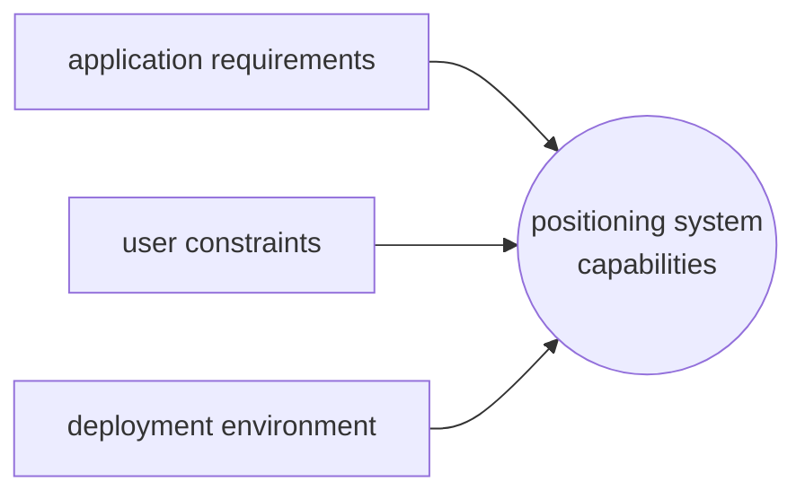

# TAXONOMY

Positioning systems can be classified in different categories

| CATEGORY          | DESCRIPTION                                                |
| ----------------- | ---------------------------------------------------------- |
| **PHYSICAL**      | position is computed as a numerical value                  |
| **SYMBOLIC**      | position is computed as a logical value (*e.g. city name*) |
| **ABSOLUTE**      | position is computed with a single reference system        |
| **RELATIVE**      | position is relative to some element of the infrastructure |
| **CENTRALIZED**   | one nodes computes positions of the other nodes            |
| **DECENTRALIZED** | each nodes compute is own position                         |

The deployment environment dictates what feature is requested from the positioning system together with  application requirements and user constraints

