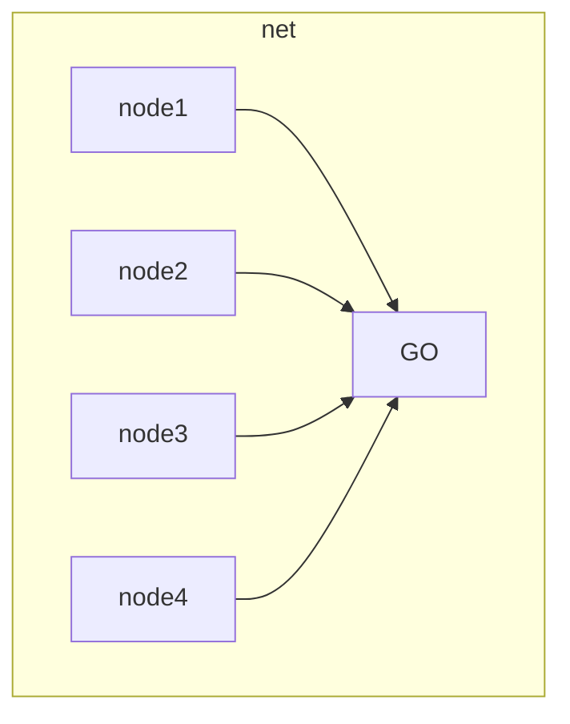

# WIFI DIRECT

ad hoc mode of wifi (not really ad hoc infrastructure, its something that try to be) technology where one of the nodes impersonate the ap of a structured infrastructure

The control frame exchanged between the nodes are the same as wifi in infrastructured architecture

Connect to a group owner is called pairing

Performance degrades due to the fact that the group owner it's a huge bottleneck in terms of power consumption, performance of the software ap implementation resources ecc.

NO INTELLIGENCE IS DEPLOYED IN THE CHOICE OF THE GROUP OWNER

## WIFI TRENDS

# WIRELESS MAN (WIMAX)

Goal broadband access in metropolitan area

The idea is to connect fixed antennas covering long distances. The protocol is publisher/subscriber model 

## PERFORMANCE

- Maximum datarate = 70Mbps (in first version; think to current datarates of IEEE 802.11 variants and 5G cellular networking)
- large distances covered

# IEEE 802.11s

Goal city wide wifi coverege with a mesh wifi network infrastructured where only a few nodes are connected to the internet infrastructure and the nodes distribute packet using wifi signals.It also consent to route the traffic inside the mesh network itself

# IEEE 802.20

Goal broadband for vehicle communication, address the speed of movements of the nodes 

No commercial success due to wifi evolution improvements (802.11p)

