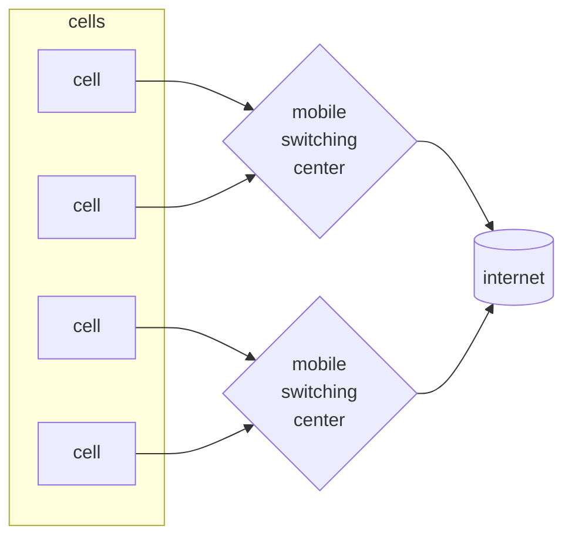
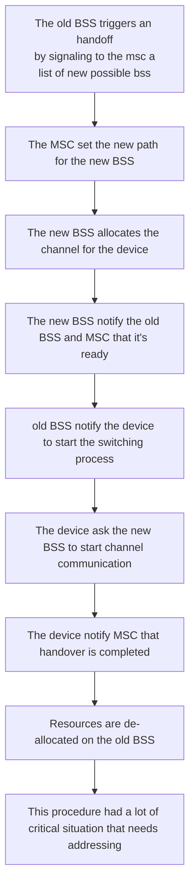

# CELLULAR NETWORKING

Originated from the evolution of telecom solution of communication of mobile devices, based on a grid of low powered antenna for scalability reason, frequencies can be reused in non adjacent cells The architecture is the following:

Where:

- cells service a base local area, and is the connection point for the mobile devices
- MSC manages mobility of the nodes, connection to the van and setup of local calls

The range of a single cell depends on many factors such as:

- landscape and obstacles
- technology used

In common deployment scenarios cells coverage area overlaps, this enables QoS practices

## TECHNOLOGY EVOLUTIONS

With time cellular networking technology converged in the internet communication technologies

| GENERATION | FEATURES                                 |
| ---------- | ---------------------------------------- |
| 2(GSM)     | digital communications, only voice calls |
| 2.5(GPRS)  |                                          |
| 3(UMTS)    |                                          |
| 4(LTE)     |                                          |

## GSM ARCHITECTURE

Where:

- **MS** is the mobile node that communicates whit the **BSS** using the hardware support of the **MT** and authenticates with the **TE** component towards the infrastructure
- **BSS** communicates with the single nodes with the **BTS** component that manages handovers signals channel allocation and frequency hopping, the communication with the **MSC** is done trough the network card **A**
- **MSC** plays the role of gateway towards the **PSTN** network, the call routing is done trough the use of the **VLR** **HLR** registries
- the **OSS** components offers services of authentication of the nodes through **AUC** and the identification of fraudulent identities with the **EIR**, it also offers network monitoring control and management through the **OMC** **NMC** **ADC**

## HANDOFF

A big problem of cellular networking is to handle mobility of the phones during communication operations, there are various motivation that can cause an handoff procedure to be triggered:

- load balancing
- stronger signal from other BSS cause the node is moving towards them

**the policy is not dictated by the MSC, only the mechanism**

The principle goal of this procedure it's service continuity so in this context wasting resources is accepted

### HANDOFF PROCEDURE FOR DIFFERENT MSC

In this particular case the call is still routed trough the MSC where it has began ANCHOR MSC, other MSC are appended to the chain as the node is moving

### HANDOFF TAXONOMY

| TAXONOMY          | MEANING                                                                                                        |
| ----------------- | -------------------------------------------------------------------------------------------------------------- |
| HORIZONTAL        | Handoff is performed between same technologies                                                                 |
| VERTICAL          | Handoff is performed between different technologies                                                            |
| MOBILE INITIATED  | Handoff is started by the mobile device                                                                        |
| NETWORK INITIATED | Handoff is started by the networking infrastructure                                                            |
| REACTIVE          | Handoff is started in response to a node exiting the coverage area                                             |
| PROACTIVE         | Handoff is started before the node exits the coverage area                                                     |
| HARD              | The handoff procedure does not allow the mobile node to be connected to multiple BSS in the same time interval |
| SOFT              | The handoff procedure allow the mobile node to be connected to multiple BSS in the same time interval          |

[PREVIOUS](pages/wireless/WIMAX.md) [NEXT](pages/wireless/BLUETOOTH.md)
