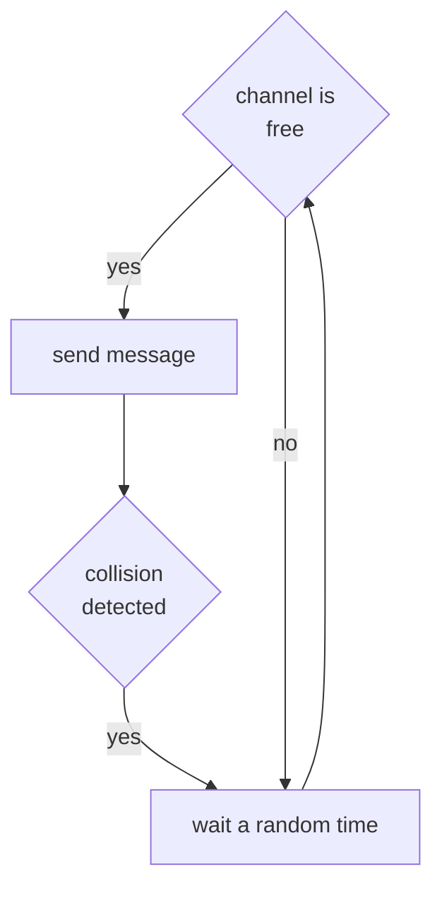
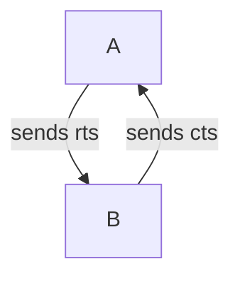

# CSMA/CD

The **CSMA/CD** relies on sensing the channel and transmit only when the channel il free

In wireless environment this approach have some issues due to the nature of the nodes not being able to listen the entire channel and the node mobility

### HIDDEN AND EXPOSED NODE ISSUES

This are particular problems that can manifest in a wireless environment

### CSMA/CA VARIANT

A way to limit the hidden/expose node issue is to send short acknowledgement frames before transmit:

so the node **A** sends a request to send packet to **B** and wait for a clear to send reply before start transmitting the data

this solution limits collisions only to the **rts** and **cts** packets reducing the cost of re transmission but increase the overhead because every communication requires an rtc/cts exchange

## TOKEN RING

[PREVIOUS](pages/wireless/MEDIUM_ACCESS_CONTROL.md) [NEXT](pages/wireless/WIFI.md)
