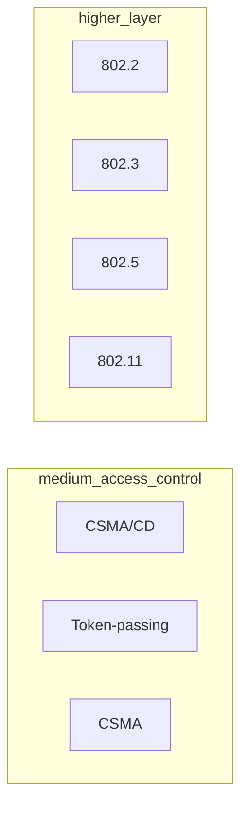
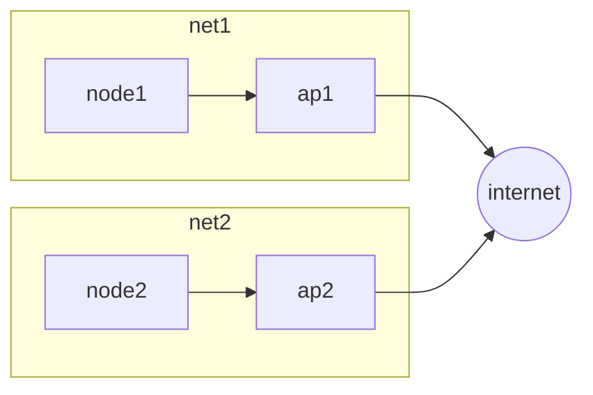
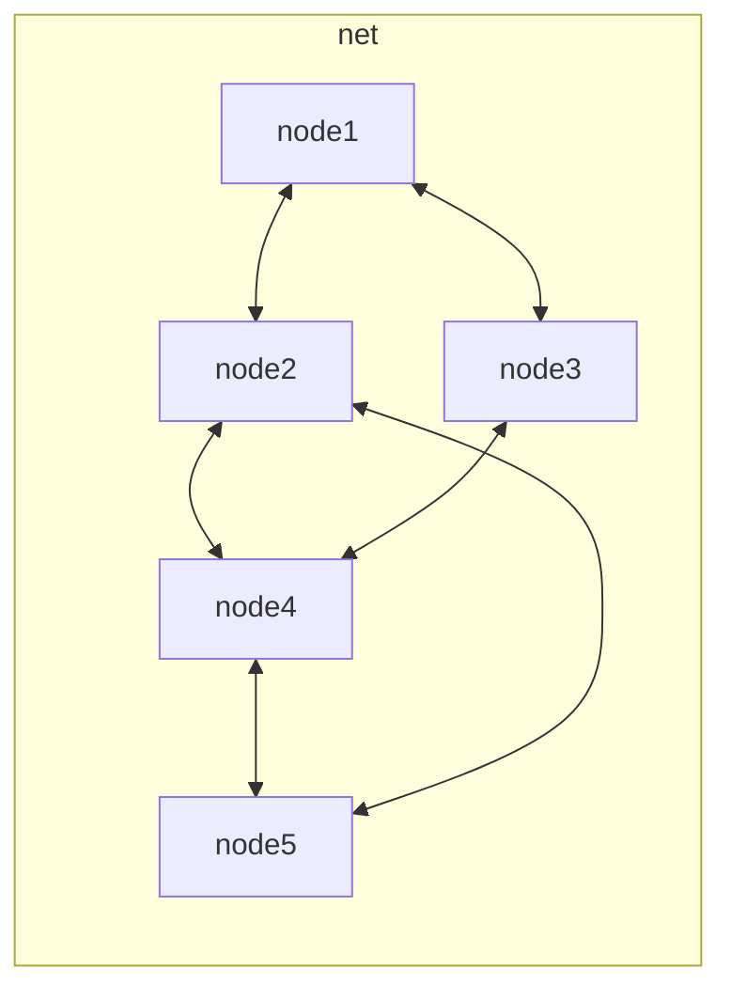

# MEDIUM ACCESS CONTROL

IEEE defines a section of standards for wireless connectivity technologies at data link layer under the section 802.xx

## WIRELESS ARCHITECTURES

There are two possible configuration for a wireless infrastructure:

- **BASE STATION MODE** where the nodes are connected to a base station and communication can only append trough the base station itself

- **AD HOC MODE** all nodes are potentially mobile and communicate directly

[PREVIOUS](pages/wireless/WIRELESS_COMMUNICATION.md) [NEXT](pages/wireless/CSMA.md)
