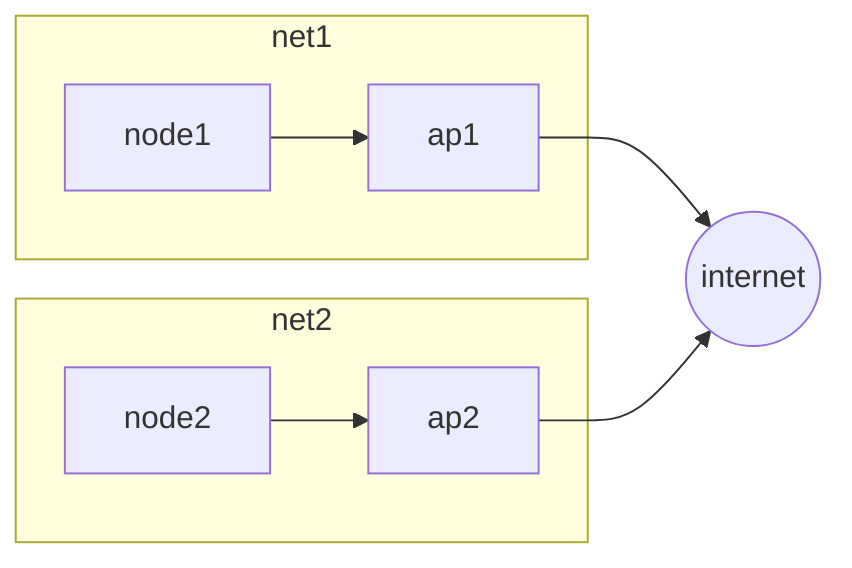
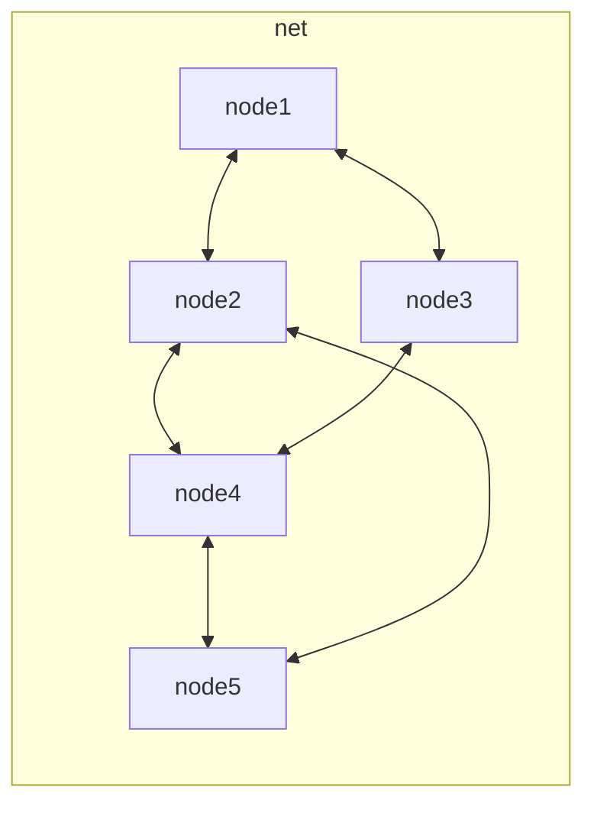

# WIFI

The IEEE 802.11 standard is the most widespread solution for wireless communications, it provides 2 primary configurations

- **BASE STATION MODE** where the nodes are connected to a base station and communication can only append trough the base station itself

- **AD HOC MODE** all nodes are potentially mobile and communicate directly, en example of ad hoc network are [manets](MANETS.canvas)

## WIFI MESH NETWORK

The objective is to cover with wireless connectivity technology wide areas like cities with a mesh network

[PREVIOUS](pages/wireless/CSMA.md) [NEXT](pages/wireless/WIMAX.md)
