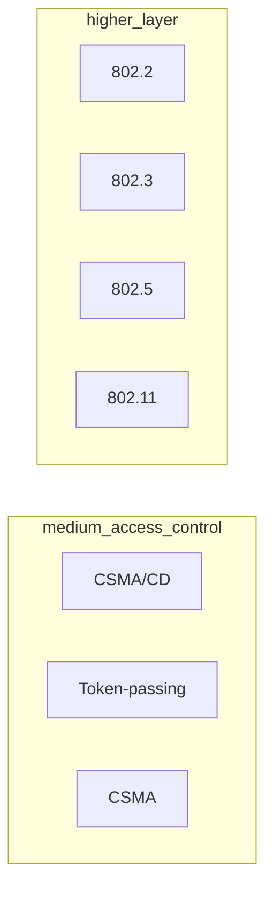
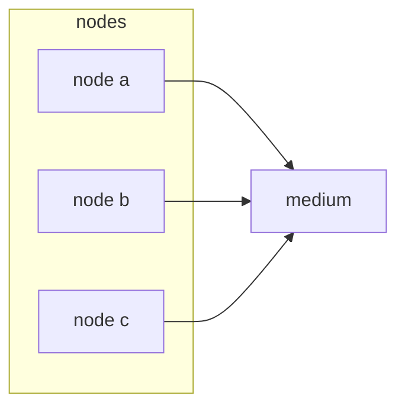
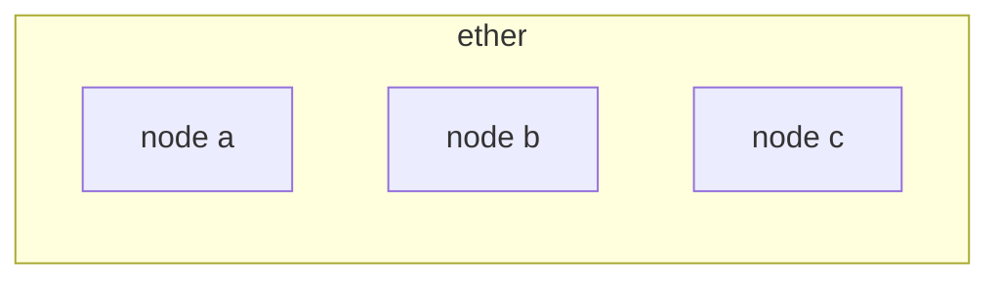

# WIRELESS CONNECTIVITY TECHNOLOGIES 

IEEE defines a section of standards for wireless connectivity technologies at data link layer under the section 802.xx

## ETHERNET PROTOCOL 802.x

in a physically connected network all nodes share the same communication medium, so there is the need to handle collisions

There are also solution that avoid collisions like token-passing ring that relies on a token being passed between nodes and only the nodes that have the token can transmit, this solution has a lot of overhead due to the token passing case

In Wireless networks there is also the same problem cause the ether is shared among the notes

## WIRELESS PROTOCOL

The wirless protocol is the same as the ethernet ones, CSMA

Due to the nature of the protocol there are no certainties about the communication performances

In order to avoid the hidden node problems the MACA (multiple access collision avoidance) which relies on requests and replies in order to start communication, this is not the default behavior 
MACA not avoid collisions of pre data communication or in cases some nodes joins the network after pre data communication appens

### WIFI ARCHITECTURES

#### BASE STATION

This is a classical use case that it's completely handled by the standard TCP/IP stack

In this configuration there are still problems due to nodes movements
#### AD-HOC P2P

In this architecture, no HW infrastructure is required but a lot of communication problems rise up (for example re-transmissions time increase with the number of nodes), and TCP/IP does perform poorly

